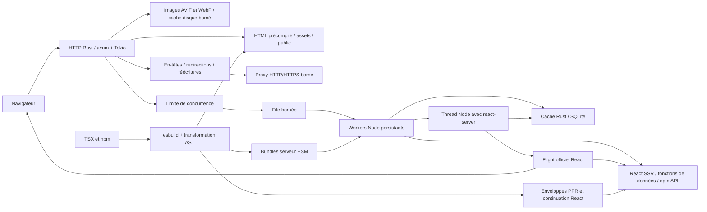

# Architecture

Les budgets de buffers de réponse, la déduplication des artefacts PPR et les variantes d’admission adaptative, PGO et mimalloc sont détaillés dans [Réduction des ressources](resource-optimization.md). Le budget des files de réponse est distinct du budget des corps entrants et ne constitue pas un plafond global de RSS.

## Build

`packages/rustyx/build` inspecte les routes, refuse les constructions incompatibles connues, compile séparément les graphes serveur et navigateur puis produit `.rustyx/manifest.json`. Les imports des fonctions `getServerSideProps`, `getStaticProps` et `getStaticPaths` sont retirés du graphe navigateur avant résolution. Les dépendances partagées avec le composant restent disponibles. Les props retournées par ces fonctions sont volontairement publiques : elles sont sérialisées dans le HTML.

Les fichiers `.env*` sont chargés avant `rustyx.config.*` ou `next.config.*`. Le build compile les règles d'en-têtes, redirections et réécritures dans un manifeste borné, puis injecte les valeurs publiques dans les graphes serveur et navigateur. Les valeurs privées ne sont pas sérialisées automatiquement. Chaque worker charge les fichiers d'environnement du déploiement avant le code applicatif. Le [guide de configuration](configuration.md) décrit les options et phases disponibles.

Les pages fixes sans SSR et les chemins déclarés par `getStaticPaths` sont rendus au build. Les assets sont nommés d'après leur contenu et les modules communs sont partagés entre les entrées navigateur.

Avant publication du build, les fichiers compressibles de `static/` et `assets/` reçoivent une variante `.gz` si elle est plus petite que l'original. Deux pipelines gzip au maximum lisent et écrivent en flux pour borner les tampons de compression. Les fichiers vides, liens symboliques et formats déjà compressés sont exclus ; `public/` et les bundles serveur ne sont pas précompressés. Le fichier d'origine et sa variante reçoivent la même date de modification pour permettre la vérification de fraîcheur côté Rust.

Les routes serveur partagent aussi des chunks ESM : une dépendance applicative commune est chargée une fois par worker, ce qui réduit les duplications et conserve un état de module cohérent entre les routes.

L'App Router construit trois graphes : composants serveur sous la condition `react-server`, composants client rendus en SSR, et composants navigateur. Une directive `'use client'` devient une référence Flight dans le premier graphe. Les exports CJS et ESM des packages npm sont conservés dans les frontières client. Les imports `server-only`/`client-only` sont vérifiés. Les identifiants des composants et les modules SSR/navigateur associés sont inscrits dans le manifeste ; les modules client inutilisés ne sont pas évalués pendant le SSR.

Les packages npm contenant des addons `.node` restent externalisés côté serveur, avec leur chargeur et leurs fichiers adjacents dans `node_modules`. La détection parcourt les fichiers des packages atteints et leurs dépendances déclarées, avec un cache de découverte, pour conserver aussi les `require()` calculés et `__dirname`. Les packages nécessitant des transformations CSS ou des frontières client restent compilés. Le build vérifie les versions exactes React/ReactDOM/RSDW requises par l'intégration Flight. Le build exécute aussi les `generateStaticParams` des layouts puis des pages. Les pages App partageables produisent une paire HTML/Flight ; les usages de données propres à la requête les font revenir au rendu dynamique en mode auto. Les configurations statiques strictes échouent au lieu de conserver ces données.

La compilation écrit dans un dossier temporaire et remplace `.rustyx` seulement après réussite. Une erreur de compilation conserve le dernier build valide. Ce mécanisme n'est pas un déploiement atomique multi-processus : en production, construire dans un autre dossier puis lancer une nouvelle instance. Le mode dev reconstruit puis redémarre le serveur et ne conserve pas l'état React.

## Serveur natif

Le binaire contient le serveur HTTP, le routage, la compression et la gestion des workers. Les fichiers sont transmis avec `tower-http` sans les charger intégralement dans un cache mémoire applicatif. Les chemins sont décodés une seule fois, validés et canonisés avant ouverture pour empêcher les traversées et les sorties par liens symboliques.

Pour les fichiers produits au build, Rust sélectionne la variante gzip selon `Accept-Encoding` seulement si son chemin canonique reste dans le dossier de l'original et si leurs dates de modification correspondent exactement. Une variante absente ou périmée laisse la compression à la demande disponible. Les réponses ajoutent `Vary: Accept-Encoding`, y compris pour la représentation non compressée et les réponses 304. HEAD sur une variante précompressée conserve sa longueur sans transmettre de corps. Les fichiers modifiables de `public/` utilisent toujours la compression à la demande et ignorent les variantes `.gz` adjacentes.

Un projet purement statique peut être servi sans démarrer Node. Node et les dépendances applicatives sont nécessaires pour les premières requêtes dynamiques. Le runtime et les adaptateurs sont copiés dans `.rustyx/` au build. Le binaire peut donc servir ce dossier et les dépendances du projet sans accéder au checkout du framework. React et ReactDOM sont résolus depuis l'application pour partager une seule instance avec ses paquets npm.

Les règles natives suivent l'ordre en-têtes, redirections, `beforeFiles`, fichiers/routes fixes, `afterFiles`, routes dynamiques, `fallback`. Elles conservent séparément l'URL originale et la destination. Les lectures de pages partagées réécrites ajoutent des métadonnées de navigation propres à la requête ; ces réponses HTTP sont privées sans cache, sans validateurs. Pour le HTML, Rust injecte un bloc JSON échappé en conservant une fenêtre finale bornée, ce qui contourne la variante précompressée. Le cache interne des pages reste partagé et les lectures canoniques conservent leur chemin de service normal.

Les destinations HTTP/HTTPS passent par un client reqwest/rustls créé à la demande, sans worker Node. Seize flux au maximum sont actifs ; jusqu’à 256 demandes supplémentaires attendent au plus 30 secondes, sans lecture de leur corps ni connexion à l’origine. La capacité reste attachée au corps jusqu'à consommation ou annulation. Les corps traversent le proxy en flux, sans assemblage de la réponse ; les blocs sortants sont limités à 64 Kio. Les connexions inactives sont bornées par origine et au total. Les en-têtes de connexion sont retirés, les cookies multiples sont conservés et aucune requête n'est rejouée. Une réponse d'origine redirigée est transmise au client sans être suivie par le proxy.

## Middleware et proxy applicatif

Le build compile un fichier `middleware` ou `proxy` dans un module serveur distinct et extrait ses matchers depuis des constantes AST, sans importer le code applicatif. Les dépendances npm ordinaires traversent les adaptateurs de compatibilité ; les chargeurs natifs restent externalisés. Les graphes navigateur et RSC ne reçoivent pas ce module.

Rust évalue les matchers après les en-têtes et redirections configurés, avant `beforeFiles`. Un chemin exclu ne démarre aucun worker de middleware. Un chemin inclus utilise le pool de rendu partagé, créé à la demande, avec 16 places de travail par worker. Les anciens builds stdio conservent leur worker middleware dédié et son arrêt après 30 secondes d’inactivité. Les contrôles de continuation sont consommés avant de transmettre la requête à son handler : un seul worker de rendu suffit, même si le middleware utilise `waitUntil`.

Le corps entrant est limité à 8 Mio et conservé pour que le middleware et la destination disposent de lecteurs indépendants. Le budget d’admission des corps est de 32 Mio, partagé entre le middleware et le rendu, en unités de 64 Kio ; les corps de taille inconnue réservent leurs 8 Mio avant lecture. Pour les nouveaux workers socket, jusqu’à 1 024 requêtes peuvent attendre l’admission du middleware pendant au plus 30 secondes avant lecture de leur corps ; cela accepte la rafale de modules d'une page sans contourner son proxy. Les réponses finales utilisent le transport progressif et ses blocs de 64 Kio ; les annulations et délais libèrent les places de travail. Les continuations n'ont aucun corps public. Les en-têtes internes reçus du client ne peuvent ni court-circuiter le middleware ni simuler ses mutations.

`waitUntil` observe les promesses sans bloquer la boucle du worker. Le registre est limité à 32 invocations et 128 promesses au total, avec un délai de 25 secondes. Les erreurs sont journalisées. Les promesses applicatives arbitraires ne peuvent pas être annulées de force ; le signal de requête permet une annulation coopérative. Ces limites bornent le suivi du framework, pas les allocations internes d'un package.

À l'expiration, les observateurs du framework détachent leurs références vers l'invocation. Leur normalisation de Promise et leurs réactions sont créées hors du contexte asynchrone de requête, afin qu'une promesse externe toujours bloquée ne conserve pas ses corps ou son cache local. Les rejets tardifs restent observés. Les promesses et contextes détenus par le code applicatif gardent leur propre durée de vie.

Les en-têtes de réponse du middleware prennent priorité sur ceux de la destination et sont également transmis à sa requête. Les cookies de réponse sont réunis dans l'ordre middleware puis destination, sans doublons identiques. Les données de navigation propres à la requête gardent leur politique privée sans cache et leurs validateurs retirés. Les [règles de middleware](middleware.md) précisent les différences entre en-têtes ordinaires, remplacements de requête et cookies de rendu.

## Cache de données

Rust expose un service privé sur la boucle locale avec un jeton aléatoire, transmis uniquement aux workers par environnement. Les adaptateurs `unstable_cache` et `fetch` lui adressent les lectures, écritures et invalidations. Une référence au `fetch` natif est conservée avant installation de l'adaptateur pour éviter que les requêtes du cache ne se cachent elles-mêmes. Les réponses RPC restent bornées et utilisent JSON/base64 ; ce chemin est distinct du transport binaire des réponses HTTP applicatives.

Le délai de cinq secondes d'un RPC couvre ses en-têtes et son corps JSON. Son timer est annulé dès la fin de l'opération, y compris lors d'une erreur, pour libérer immédiatement le contexte de requête hérité. L'annulation de la requête interrompt également la lecture en cours.

Les lectures PPR versionnées résolvent leur génération, leur clé et leur lease dans une seule transaction native : un hit ne nécessite plus un RPC préalable pour la génération. La génération reste persistante et n'est pas mémorisée dans les workers. Le remplissage d'une enveloppe du build revérifie la génération après acquisition du lease ; une invalidation rejette les commits devenus obsolètes. La connexion du cache de données réutilise au maximum 32 requêtes SQL préparées, dont les paramètres sont libérés après utilisation. Ce cache de plans n'ajoute pas de copie persistante des réponses ; il reste distinct du pager et des plafonds de données.

Le transport HTTP local du cache conserve ses connexions entre rafales, avec un maximum de 32 connexions par pool, y compris inactives, et une expiration après 30 secondes d’inactivité. Réduire la liste inactive à quatre provoquait des fermetures et ouvertures répétées sous concurrence ; ce renouvellement pouvait épuiser les ports éphémères de la machine. Le pool reste indépendant des contextes de requête et des corps des visiteurs.

Les hits frais passent par une transaction de lecture sans écriture pendant une fenêtre de 1 seconde suivant leur dernier rafraîchissement LRU. La requête SQL vérifie les TTL, l’expiration dure, les associations demandées et la génération dans le même instantané. L’ajout d’un tag, un TTL plus court ou une entrée périmée revient au chemin transactionnel d’écriture. Le nettoyage global des leases est regroupé ; chaque acquisition vérifie encore l’expiration du lease concerné. Seul l’ordre LRU est approximatif dans cette fenêtre, jamais la validité d’une réponse. Aucun dictionnaire de réponses supplémentaire n’est ajouté en RAM.

SQLite conserve les valeurs dans `.rustyx-cache/data.sqlite3`. La connexion s'ouvre à la première opération et utilise par défaut un cache de pages de 2 Mio, sans `mmap`. `cacheMaxMemorySize` peut remplacer les budgets des deux bases natives. Les transactions, allocations de réponses et encodages volumineux se font hors des exécuteurs asynchrones. Huit opérations au maximum sont admises, corps et réponse compris. Un refus temporaire `503` est réessayé avec une attente bornée par l'adaptateur. La base survit aux remplacements atomiques de `.rustyx` et aux redémarrages. Elle exige un emplacement inscriptible ; son répertoire n'est pas configurable.

Les gestionnaires applicatifs [`cacheHandler`](incremental-cache.md) et [`cacheHandlers`](cache-components.md) fournissent des stockages externes pour leurs contrats respectifs. Ils restent chargés uniquement lorsqu'ils sont configurés. Avec le premier, Rust coordonne les productions de données entre workers par des baux sans conserver une deuxième copie de la valeur externe. Pour les pages complètes, le backend est consulté avant de réutiliser les fichiers locaux ; un identifiant de version évite de retransmettre et réécrire les paires inchangées. Les transactions distribuées entre machines restent du ressort du gestionnaire.

Une entrée absente accorde un bail à un seul producteur ; les autres lectures attendent. Une entrée périmée peut être servie immédiatement pendant qu'un seul producteur la renouvelle. Les baux et leur génération sont vérifiés au commit : une invalidation empêche un calcul ancien de réintroduire sa valeur. Les tags et chemins s'attachent aussi aux hits partagés. Les valeurs restent sur disque ; les tables JavaScript ne conservent que le travail en cours, avec échéance et suppression à sa fin.

La réponse d'un `fetch` est disponible dès ses en-têtes. Le corps est lu une seule fois, tandis qu'une copie bornée prépare éventuellement le cache. Au-delà de 2 Mio, après 1 seconde sans progression ou 20 secondes au total, cette capture s'arrête ; le flux demandé par l'application continue. Les réponses avec `Set-Cookie`, les corps de requêtes opaques et les valeurs non réutilisables contournent le cache. Les GET rendus plusieurs fois dans une même requête peuvent réutiliser leurs octets, avec un budget distinct de 8 Mio et 128 entrées. Cette mémoïsation est conservée lors d'un rendu de fallback.

Chaque contexte de requête porte une file d'invalidations et un ensemble de renouvellements en cours. Une lecture attend les invalidations antérieures de ce contexte. Les actions attendent leurs invalidations avant de rendre l'arbre actualisé. Les réponses progressives se terminent avant l'attente de leur travail de cache en arrière-plan ; les réponses Flight encore tamponnées attendent cette finalisation. Une erreur d'import ou de handler libère également ce travail. Une invalidation qui échoue après création d'une Response annule son corps avant de signaler l'erreur.

Le [guide du cache](caching.md) précise les API, les différences restantes avec Next.js et les conditions de persistance. Les caches de pages [Pages Router](isr.md) et [App Router](app-static.md) sont distincts du cache de données. L'invalidation des données touche aussi les pages App concernées. Les [Cache Components](cache-components.md) utilisent des valeurs React sérialisées et des enveloppes PPR distinctes des paires HTML/Flight complètes.

## Cache des pages

Les pages avec `getStaticProps` produisent au build une paire HTML/JSON et une durée de régénération. Rust sert directement les fichiers frais et peut servir une version périmée pendant son renouvellement. Les chemins absents utilisent le mode fallback déclaré. Une erreur conserve la dernière version valide.

Les pages App utilisent le même cache avec une paire HTML/Flight. Une requête `RSC: 1` sélectionne Flight, avec un ETag distinct et un en-tête `Vary` approprié. Les POST d'actions restent dynamiques. Les données privées du premier visiteur ne participent pas au calcul d'une entrée partagée.

Les handlers App explicitement statiques réutilisent ce stockage avec un seul fichier binaire `.body`, son statut et ses en-têtes, y compris les valeurs `Set-Cookie` multiples. Ils ne créent aucun fichier HTML/Flight compagnon. Leur corps est limité à 16 Mio. Les lectures partagées ignorent le marqueur RSC et ne reçoivent pas de métadonnées de navigation lors d'une réécriture, même pour du HTML. Une réponse possédant déjà `Content-Encoding` n'est pas recompressée. Le build exécute seulement le générateur du fichier `route`, sans hériter des layouts.

Le stockage `.rustyx-cache/pages/` associe les entrées à un identifiant interne neuf à chaque build, distinct de l'identifiant public configurable. Une génération écrit des fichiers immuables et leurs variantes gzip utiles, puis publie leurs métadonnées dans une transaction SQLite. Les lecteurs déjà en cours conservent leurs fichiers. Les corps traversent le transport binaire en blocs ; la trame initiale annonce les longueurs HTML et JSON/Flight, vérifiées avant publication.

Un pool séparé contient un worker de maintenance démarré à la demande et arrêté après 30 secondes d'inactivité. Cette séparation permet à une API d'attendre `res.revalidate` avec un seul worker de requêtes, sans occuper la capacité nécessaire au calcul. Cinq générations au maximum sont admises ; plusieurs demandes du même chemin attendent le même calcul. Cette coordination reste locale au processus.

La génération d'un handler utilise ce même pool sans démarrer de thread RSC. GET et HEAD partagent la clé de chemin ; les autres méthodes restent dynamiques. Les accès aux données de requête sont détectés aussi sur les clones et les lectures différées du corps de réponse. Les [règles des handlers statiques](route-handlers-static.md) détaillent les bascules vers le mode dynamique, les statuts et les écarts de compatibilité.

Les données JSON du Pages Router sont accessibles sous `/_rustyx/data/{buildId}/...json` et l'alias `/_next/data`. Le [routeur client Pages](pages-navigation.md) charge les modules, les CSS et les données de la destination sans recharger le document ni remonter `_app`. Les navigations vers `getServerSideProps` exécutent la fonction de données sans rendre le composant React ; celles vers `getStaticProps` réutilisent ce cache natif. Une visite initiale fallback remplace ensuite ses props de la même façon. Les paramètres de recherche du visiteur sont rétablis après hydratation, sans être stockés dans la page commune.

Les tags et chemins des pages App sont enregistrés avec la paire. Les invalidations persistent aussi pour les versions initiales du build. Une révision native empêche un calcul commencé avant une invalidation de publier son ancien résultat. Une requête GET peut refaire ce calcul une fois ; les mutations ne sont pas relancées. Les invalidations de données partagées étendent les chemins concernés avec des bornes ; un dépassement invalide plus largement le cache App pour préserver la fraîcheur.

## Exécution JavaScript

Le pool démarre les workers à la demande et les réutilise. Chaque nouveau worker peut faire progresser jusqu’à 16 opérations asynchrones ; les contextes de requête restent isolés. Plusieurs workers permettent aussi de répartir le travail CPU, au prix d’une copie du runtime et du graphe de modules par processus.

Le dispatch charge séparément les modules HTTP, API, middleware et les moteurs de rendu. Les API Pages, les Route Handlers App et leur génération statique n'importent pas React ou ReactDOM à travers le framework. Le middleware suit le même chemin léger. Les requêtes de données Pages exécutent leur fonction sans rendu React ; l'import de `react-dom/server` est différé jusqu'au premier rendu HTML Pages. Le premier rendu App charge son moteur sans initialiser les contextes Pages `router` et `head`. Les imports explicites de l'application restent libres de charger ces bibliothèques. Les modules sont ensuite conservés dans le même processus, avec leur état ; ce chargement différé ne réinitialise pas le worker.

Les entrées explicitement [Edge](edge-runtime.md) sont compilées selon les conditions Web puis évaluées dans la VM V8 officielle, chargée à la première utilisation. Le code applicatif des pages et de leurs composants client SSR s'exécute dans cette VM ; React, ses registres de références et l'orchestration des rendus utilisent des ponts contrôlés vers le moteur existant. Chaque runtime de build réutilise au plus un contexte React RSC et un contexte React SSR par worker, avec des factories lexicales distinctes pour les bundles. Les graphes Node conservent leurs modules propres. Cette VM fournit un contrat d'API Web, pas une frontière de sécurité ni un moteur JavaScript écrit en Rust.

Au premier rendu dynamique ou calcul d'une page App, le processus Node crée un thread persistant séparé avec `--conditions=react-server`. Ce thread utilise le runtime officiel `react-server-dom-webpack` pour sérialiser l'arbre serveur ; le processus parent décode Flight puis produit le HTML avec ReactDOM et les composants client. Les réponses `RSC: 1` renvoient directement Flight. Les cookies et en-têtes utilisent un contexte de requête asynchrone ; ils ne passent pas dans un état global commun aux requêtes.

Le rendu App transmet Flight depuis le thread RSC par blocs transférables d'au plus 64 Kio. Le parent accorde un crédit à chaque lecture : le thread ne remplit pas une file de messages sans limite. Pour les réponses encore tamponnées, notamment les formulaires natifs, Flight possède son propre `ArrayBuffer`, transféré au parent sans clonage des octets.

Le parent décode Flight pendant sa réception et lance le rendu HTML React. Une frontière Suspense peut donc transmettre son fallback avant la fin d'un composant serveur. Les blocs Flight sont intégrés progressivement au document, puis supprimés du DOM après lecture. Le module navigateur se charge de façon asynchrone et hydrate le layout pendant que les autres blocs arrivent. Les transitions App récupèrent un nouveau Flight, mettent à jour l'arbre et conservent l'état des layouts partagés. Les requêtes obsolètes sont annulées et ne peuvent pas écraser une navigation plus récente. Le préchargement explicite est borné.

Le composant [`Script`](scripts.md) décrit un chargement navigateur sans exécuter ni télécharger son contenu côté serveur. Pages collecte les déclarations pendant le rendu unique de la page et de `_document`, puis complète le HTML avec l'ordre et les attributs du document. App transmet les déclarations `beforeInteractive` dans une file exécutée avant l'hydratation. Un registre lié au document partage les promesses des sources et mémorise les identifiants chargés pendant les navigations ; il n'ajoute aucun cache global au SSR. Les pages contenant ces scripts peuvent rester précompilées et être servies par Rust sans démarrer Node. Le mode expérimental Pages `worker` copie Partytown au build ; le navigateur lance ensuite son Web Worker.

Les nouveaux workers annonçant `rustyx-concurrency:512` acceptent jusqu’à 512 connexions TCP locales indépendantes et authentifiées par processus. Rust réserve séparément jusqu’à 512 admissions API et 16 admissions de rendu React par processus ; ces catégories partagent le pool de connexions et le budget de corps. Chaque catégorie dispose de `min(256 × workers, 1024)` places d’attente. Le middleware dispose de 512 admissions par processus et de 1 024 places d’attente maximum. Un ordonnanceur réutilise en priorité les connexions récemment libérées et crée les autres uniquement sous demande ; après 30 secondes d’inactivité, les connexions supplémentaires libèrent leurs buffers. Les anciens workers socket sans ce marqueur gardent la limite de 16 connexions. Les tâches asynchrones partagent le même heap Node, tandis que Rust gère leur admission, leur attente et leurs files de réponse bornées. Le proxy/middleware Next utilise le même pool que le rendu ; il ne nécessite plus un processus séparé. La fermeture du parent arrête le worker via son pipe de vie. Le marqueur `rustyx-transport:socket-v2` active le transport binaire des corps entrants ; `socket-v1` conserve son protocole JSON/base64. Les anciens builds et workers personnalisés sans ces marqueurs restent en stdio. La capacité binaire est négociée à l’ouverture du processus. Une recompilation du projet est nécessaire pour bénéficier des nouveaux workers.

Les corps entrants v2 sont transmis après une ligne JSON de métadonnées, sans encodage base64. Le lecteur Node borne la ligne à 256 Kio et le corps à 8 Mio ; les fragments TCP ne changent pas les octets du corps. Une réservation partagée suit les corps du middleware jusqu’au rendu ou au proxy, puis jusqu’à la fin de leur traitement. Après lecture d’un corps de taille inconnue, la réservation est réduite à sa taille réelle, arrondie à 64 Kio. Un corps annoncé vide n’alloue pas de réservation. Ce budget ne plafonne pas le RSS : copies des bibliothèques, allocations applicatives, buffers réseau et données retenues par du code ignorant l’annulation restent distincts.

Un signal de vie toutes les secondes permet à Rust de retirer un processus dont la boucle Node ne répond plus pendant 30 secondes. Une invocation qui ignore la fermeture de sa connexion dispose de 5 secondes pour se terminer avant retrait du processus. Le suivi porte sur la promesse applicative, même si la couche HTTP a déjà rejeté la requête. Le travail poursuivi après une réponse complète reste borné à 30 secondes. Le retrait peut interrompre d’autres requêtes partageant ce processus ; aucune mutation n’est rejouée automatiquement. Le thread RSC conserve également son délai de retrait après annulation, jusqu’à confirmation de sa terminaison, et est retiré à partir de 16 rendus abandonnés non terminés.

En production, les manifestes immuables des modules clients et des actions sont enregistrés dans le thread RSC une seule fois, puis référencés par identifiant. Le registre conserve au maximum 32 manifestes, avec éviction ordonnée sur le même canal que les requêtes. Les tables dérivées du bundler utilisent des références faibles ; aucun modèle React décodé ni contexte visiteur n’y est conservé. Le mode développement retransmet les manifestes pour respecter les changements du build. La préparation PPR possède séparément un registre borné de valeurs statiques détachées du décodeur, décrit dans [Cache Components](cache-components.md). Il exclut les modèles vivants et les valeurs non rejouables.

Les requêtes Rust–Node v2 utilisent une ligne JSON suivie du corps binaire ; le mode historique conserve le corps base64. Les réponses négocient le transport progressif : une ligne JSON `head` annonce statut et en-têtes, puis chaque ligne `chunk` annonce la longueur des octets binaires qui suivent ; `end` termine la réponse et `error` interrompt un flux défaillant. Les octets de réponse n'ont plus d'encodage base64 entre Rust et Node. Les logs applicatifs vont vers stderr. L'ancien format de réponse JSON/base64 reste accepté pour les builds précédents et les réponses vides.

La limite de concurrence n’est pas un plafond global de RAM : davantage de réponses actives peuvent augmenter les allocations applicatives et les buffers sortants, notamment avec des clients lents. Le rendu React conserve sa limite de 16 afin de contenir les arbres de continuation simultanés.

Node attend l’écriture de chaque bloc dans le transport local. Rust maintient au plus quatre blocs de 64 Kio par réponse et attend leur consommation avant de libérer la connexion de travail correspondante. Le contrôle de capacité reste détenu jusqu'à la fin, l'annulation ou l'expiration du flux. Les requêtes abandonnées libèrent aussi leurs corps en attente ; les flux expirés libèrent immédiatement leur file de blocs. La compression gzip transmet les premiers octets sans attendre la fin de la réponse.

Les Web route handlers conservent leur contexte asynchrone pendant les lectures différées. Les Pages API exposent une Writable et respectent `res.write()`/`drain`, `flushHeaders()` et les erreurs après envoi. Les mutations de cookies et d'en-têtes se terminent au moment de l'envoi. Les API peuvent dépasser 16 Mio en streaming ; le SSR Pages et les réponses HTML des formulaires natifs gardent leur traitement tamponné. Les appels Server Actions par Flight transmettent les blocs après la fin de la mutation et de ses invalidations, avec les cookies déjà fixés ; les composants serveur lents peuvent ensuite terminer progressivement sans répéter la mutation.

Avant le premier envoi, un rendu App peut encore choisir un statut d'erreur ou une redirection HTTP. Après le premier envoi, les erreurs, `notFound` et les redirections passent par les frontières React et les contrôles intégrés au flux. Le statut HTTP initial reste inchangé. Une mutation n'est jamais relancée pour réparer un flux interrompu.

Si une erreur empêche le rendu du document initial, le parent produit un document vide 500 contenant les métadonnées disponibles et le Flight original. Le navigateur monte ensuite la frontière locale `error` ou la frontière racine `global-error` à partir de l'arbre rejeté. Le serveur ne rejoue pas les layouts ni les pages pour construire cette interface. Un document GET rendu avec succès grâce à Suspense conserve le statut 200, même si Flight contient déjà une erreur. Les styles de `global-error` sont chargés avec son interface ; les styles déjà présents restent en place. Voir les [contrats de récupération](app-errors.md).

Une réponse IPC avec un mauvais identifiant, une erreur de protocole ou un dépassement de délai ferme la connexion concernée. Les autres connexions du même processus restent disponibles ; leur contexte et leurs octets sont indépendants. Un processus mort est relancé à la prochaine requête. Les anciens workers stdio conservent le remplacement du processus entier. Les requêtes échouées ne sont pas rejouées automatiquement : une API peut avoir déjà produit un effet de bord.

Les chemins PPR entièrement pré-rendus par `generateStaticParams` sont servis par le cache natif HTML/Flight, avec ses générations et invalidations. Les chemins contenant une continuation et les paramètres inconnus conservent leur rendu PPR dynamique : aucune donnée visiteur ne devient un artefact partagé.

## Server Actions

Le compilateur transforme les exports d'un module `'use server'` et les fonctions async portant cette directive. Le navigateur reçoit des références opaques, tandis que les implémentations restent dans le graphe serveur partagé avec les routes. Le manifeste privé associe chaque identifiant à un export précis ; un client ne choisit jamais un chemin de module ni un nom d'export à charger.

Les actions inline capturent les variables de leur portée. Leur sérialisation est chiffrée avec AES-GCM, une clé privée de build et un nonce aléatoire, et authentifiée avec l'identifiant de l'action. Les variables de module restent côté serveur. La clé est générée en 256 bits, ou fournie au build via `NEXT_SERVER_ACTIONS_ENCRYPTION_KEY` (base64, 128/192/256 bits). Les identifiants sont renouvelés à chaque build indépendamment de cette clé. Le build et ses dépendances peuvent être déplacés ensemble ; servir le même artefact sur plusieurs instances conserve les références et les captures.

Les captures conservent les objets usuels, cycles, dates, collections, fichiers, promesses et références à d'autres actions enregistrées. Une fonction ordinaire capturée ou une instance de classe applicative provoque une erreur. La décryption authentifie les octets avant désérialisation ; les références d'action capturées passent par la même liste d'exports autorisés que les appels HTTP.

Le navigateur encode les arguments avec React `encodeReply`. Les actions sont envoyées en POST et exécutées dans l'isolate RSC, avec `decodeReply` pour les appels JavaScript et `decodeAction`/`decodeFormState` pour les formulaires natifs. La réponse Flight transporte le résultat et l'arbre actualisé. Le contexte autorise les mutations de cookies pendant l'action, puis redevient en lecture seule pendant le rendu. Les formulaires natifs utilisent une redirection 303 ; les appels JavaScript reçoivent une instruction de navigation Flight suivie d'un GET pour éviter de rejouer le POST.

Rust vérifie l'origine et limite le corps d'une action avant de transmettre le travail à Node. L'origine doit correspondre à `Host`, ou à `X-Forwarded-Host` lorsque cet en-tête est présent ; un reverse proxy doit donc remplacer cet en-tête avec le domaine public attendu. Les clients sans en-tête Origin restent admis, sauf s'ils signalent une provenance navigateur `cross-site`. Cette protection ne remplace pas l'autorisation applicative : une action reste un point d'entrée public et doit vérifier ses arguments et les droits de l'utilisateur.

Une mutation n'est exécutée qu'une fois par requête et n'est pas rejouée lorsque le rendu de sa réponse échoue. Un délai dépassé entraîne le remplacement de l'isolate : l'application peut avoir déjà effectué un effet externe avant ce délai. Le transport ne promet pas de transaction sur une base de données ou un service distant.

## Bornes

| Ressource | Limite |
| --- | --- |
| Workers de requêtes | 1 par défaut, 1 à 64 configurables |
| Règles de configuration | 1 000, manifeste compilé de 2 Mio au maximum |
| Proxy externe | 16 flux actifs, 256 demandes en attente au plus 30 s, blocs sortants de 64 Kio |
| Connexions proxy inactives | 64 origines, 2 connexions par origine, expiration après 30 s |
| Connexion proxy / premiers en-têtes / inactivité | 10 s / 30 s / 30 s |
| Worker ISR Pages / App | 1 supplémentaire à la demande, arrêté après 30 s d'inactivité |
| Middleware en attente d'admission | `min(256 × workers, 1024)`, au plus 30 s avant lecture de leur corps |
| Générations ISR admises | 5, calcul et enregistrement compris, avec un worker JavaScript |
| Cache de pages publié | 256 Mio et 4 096 entrées, variantes gzip comprises ; lecteurs anciens et calculs en cours en supplément |
| Métadonnées SQLite des pages / pager | 32 Mio / 1 Mio par défaut ; pager ajustable avec `cacheMaxMemorySize` |
| HTML / JSON ou Flight ISR | 16 Mio chacun |
| Full Route Cache externe | 16 Mio cumulés pour une paire HTML/données ou un corps de handler |
| Requêtes dynamiques actives | `16 × workers`, permis conservé jusqu'à consommation ou annulation de la réponse |
| Admission des corps entrants | 32 Mio partagés entre rendu et middleware, unités de 64 Kio ; réservation conservée pendant le traitement, allocations et copies applicatives exclues |
| Requêtes dynamiques en attente d'admission | `min(256 × workers, 1024)`, au plus 30 secondes, corps non lu par l'application |
| File de jobs Node | `16 × workers` ; les jobs annulés libèrent immédiatement leurs corps et permis |
| Lecture rapide de fichiers statiques | 64 Kio au maximum par représentation, opérations disque regroupées, sans cache persistant |
| Corps entrant transmis à Node | 8 Mio |
| Corps d'une Server Action | 1 Mio par défaut, configurable jusqu'à 8 Mio |
| Réponse tamponnée | 16 Mio décodés |
| Réponse API progressive | Pas de limite totale ; blocs et attente bornés |
| Bloc binaire IPC | 64 Kio, quatre blocs en attente côté Rust |
| Métadonnées IPC progressives | 64 Kio par ligne |
| Ligne de réponse IPC historique | 24 Mio |
| Lecture du corps entrant | 30 secondes |
| Attente de worker + premiers en-têtes | 30 secondes après lecture du corps |
| Flux natif sans progression | 30 secondes, y compris consommateur bloqué |
| API sans en-têtes ou progression | Erreur après 25 secondes ; un flux actif peut durer davantage |
| Flight et HTML App | 16 Mio chacun ; contrôle final de la réponse HTML avec son Flight embarqué |
| Rendu RSC | Annulation après 25 secondes ; destruction du thread après 28 secondes s'il ne répond pas |
| Exécution d'une Server Action | 25 secondes ; remplacement du thread en cas de dépassement |
| Préchargement App navigateur | 8 réponses au maximum, durée de vie 30 secondes ; enveloppes PPR partagées limitées à 2 Mio encodés |
| Contextes VM React Edge | 2 au maximum par worker et runtime de build, RSC et SSR chargés à la demande |
| Valeur du cache de données | 2 Mio, métadonnées de réponse incluses pour `fetch` |
| Stockage logique du cache | 64 Mio et 8 192 entrées ; éviction des moins récemment utilisées |
| Base SQLite / journal WAL conservé | 128 Mio / 4 Mio ; le WAL actif peut dépasser temporairement sa cible |
| Pager SQLite du cache de données | 2 Mio par défaut, ajustable avec `cacheMaxMemorySize` ; aucune garantie de plafond RSS total |
| Calculs natifs de cache en cours | 256 baux, expiration après 30 secondes |
| RPC privés de cache admis | 8 simultanés, jusqu'à consommation ou annulation de la réponse |
| Mémoïsation GET d'un rendu | 8 Mio et 128 entrées ; réservation préalable de 2 Mio par capture |
| Capture d'une réponse `fetch` | 1 seconde sans progression, 20 secondes au total |
| Producteur de cache JavaScript | 25 secondes ; les promesses applicatives non coopératives ne peuvent pas être interrompues de force |

Le refus de surcharge renvoie `503` et `Retry-After: 1`. Avant envoi des en-têtes, le délai natif de requête et les délais de rendu RSC/HTML renvoient `504` ; une panne du processus worker renvoie `502`. Après envoi, une panne de transport interrompt le corps. Les délais App ne sont pas remplacés par une interface `error.js`. Ces bornes limitent le travail du framework, pas les allocations internes ni les processus enfants créés par le code npm.

## Priorités de performance

Mesurer séparément les fichiers statiques, le SSR, les API, le démarrage à froid et le build. Compter les processus enfants dans la mémoire. Comparer des fonctionnalités et des versions identiques avant d'annoncer un gain sur Next.js. `npm run bench:cache` mesure séparément les appels d'origine évités et le coût des hits du cache. Les prochaines optimisations possibles sont la réduction des copies restantes, les lectures volumineuses du cache de données et une sélection plus fine de la concurrence, notamment pour les longues connexions.
